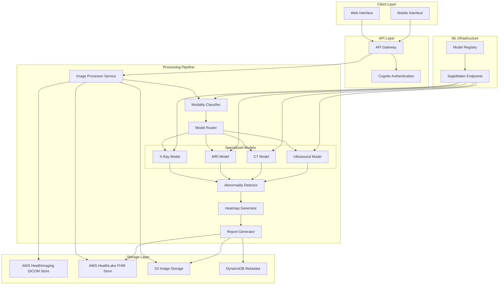
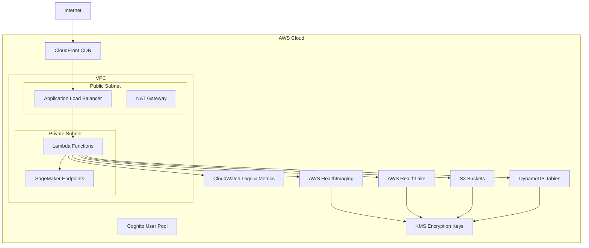

# Design Document: MedVision AI Platform

## Overview

MedVision AI is a cloud-native medical imaging analysis platform built on AWS healthcare-specific infrastructure. The system employs a microservices architecture with specialized deep learning models for analyzing four imaging modalities: X-ray, MRI, CT, and Ultrasound. The platform follows a pipeline architecture where images flow through modality classification, specialized analysis, abnormality detection, visualization generation, and report creation stages.

**AWS Healthcare Services Integration**:
- **AWS HealthImaging**: Purpose-built for medical imaging with DICOM support, automatic transcoding, and optimized storage/retrieval
- **AWS HealthLake**: FHIR-compliant data store enabling interoperability with EMR systems and standardized healthcare data exchange
- **Benefits**: HIPAA-eligible services, reduced development complexity, built-in medical imaging optimizations, seamless EMR integration

The design prioritizes:
- **Scalability**: Auto-scaling inference infrastructure to handle variable loads
- **Security**: End-to-end encryption and HIPAA-compliant data handling with purpose-built healthcare services
- **Interoperability**: FHIR-based data model for seamless integration with existing healthcare systems
- **Explainability**: Visual heatmaps and structured reports for clinical validation
- **Accessibility**: Optimized for low-bandwidth environments across Bharat
- **Modularity**: Independent services for each processing stage
- **Compliance**: Built on HIPAA-eligible AWS services designed for healthcare workloads

Key architectural decisions:
- AWS HealthImaging for DICOM image storage and retrieval with built-in medical imaging optimizations
- AWS HealthLake for FHIR-compliant healthcare data management and interoperability
- Amazon SageMaker for AI model hosting and management
- AWS Lambda for serverless inference to optimize costs in resource-constrained deployments
- Amazon S3 for non-DICOM image storage and report archival
- API Gateway for RESTful API exposure
- DynamoDB for metadata and audit logging
- CloudFront CDN for global content delivery with edge caching

## Architecture

### High-Level Architecture



### Processing Flow

1. **Upload Phase**: Healthcare professional uploads medical image through web/mobile interface
2. **Authentication**: API Gateway validates user credentials via Cognito
3. **Image Reception**: Image Processor validates format, stores DICOM images in AWS HealthImaging, non-DICOM in S3
4. **FHIR Integration**: Image metadata and patient context stored in AWS HealthLake as FHIR ImagingStudy resources
5. **Modality Classification**: Modality Classifier determines imaging type (X-ray/MRI/CT/Ultrasound)
6. **Specialized Analysis**: Model Router invokes appropriate specialized model via SageMaker endpoint
7. **Abnormality Detection**: Specialized model identifies regions of concern with confidence scores
8. **Visualization**: Heatmap Generator creates explainable AI overlay on original image
9. **Report Generation**: Report Generator creates structured diagnostic report as FHIR DiagnosticReport
10. **Storage & Notification**: Results stored in HealthLake/S3/DynamoDB, user notified of completion

### Deployment Architecture



## Components and Interfaces

### 1. Image Processor Service

**Responsibility**: Receives, validates, preprocesses, and stores medical images.

**Interface**:
```
POST /api/v1/images/upload
Request:
  - multipart/form-data with image file(s)
  - headers: Authorization, Content-Type
  - metadata: patient_id (optional, anonymized), acquisition_date

Response:
  - image_id: unique identifier
  - status: "uploaded" | "processing" | "failed"
  - presigned_url: S3 URL for retrieval
  - error: error message if failed
```

**Implementation Details**:
- Validates file format (DICOM, PNG, JPEG) using magic number detection
- Checks file size limits (max 50MB per image)
- Routes DICOM files to AWS HealthImaging data store
- Routes non-DICOM files (PNG, JPEG) to S3
- Converts DICOM metadata to FHIR ImagingStudy resources for HealthLake
- Applies lossless compression for non-DICOM storage optimization
- Generates unique UUID for each image
- Records metadata in DynamoDB with timestamps and user information
- Creates FHIR Patient and Practitioner resources in HealthLake if not existing

**AWS Services**: 
- Lambda function triggered by API Gateway
- AWS HealthImaging for DICOM storage with medical imaging optimizations
- AWS HealthLake for FHIR-compliant metadata and clinical context
- S3 for non-DICOM image storage
- DynamoDB for fast metadata queries

### 2. Modality Classifier

**Responsibility**: Automatically identifies the type of medical imaging modality.

**Interface**:
```
POST /api/v1/classify/modality
Request:
  - image_id: reference to uploaded image

Response:
  - modality: "xray" | "mri" | "ct" | "ultrasound"
  - confidence: float [0.0, 1.0]
  - requires_manual_review: boolean
```

**Implementation Details**:
- Uses lightweight CNN model (EfficientNet-B0 or MobileNetV3) for fast classification
- Model trained on multi-modal medical imaging dataset
- Confidence threshold: 0.85 for automatic routing, below triggers manual review
- Preprocessing: resize to 224x224, normalize pixel values
- Inference time target: <2 seconds
- Model hosted on SageMaker endpoint with auto-scaling

**Model Architecture**:
- Input: 224x224x3 (grayscale images converted to 3-channel)
- Backbone: EfficientNet-B0 pretrained on ImageNet, fine-tuned on medical images
- Output: 4-class softmax (X-ray, MRI, CT, Ultrasound)
- Training data: Minimum 10,000 images per modality

### 3. Specialized Models

**Responsibility**: Perform modality-specific analysis to detect abnormalities.

**Interface**:
```
POST /api/v1/analyze/{modality}
Request:
  - image_id: reference to uploaded image
  - modality: confirmed imaging type

Response:
  - abnormalities: array of detected findings
    - type: "tumor" | "lesion" | "infection" | "other"
    - confidence: float [0.0, 1.0]
    - bounding_box: {x, y, width, height}
    - severity: "low" | "medium" | "high"
  - overall_assessment: "normal" | "abnormal"
```

**Implementation Details**:

Each specialized model follows a similar architecture but is trained on modality-specific datasets:

**X-Ray Model**:
- Architecture: ResNet-50 with Feature Pyramid Network (FPN)
- Detects: pneumonia, tuberculosis, lung nodules, fractures, cardiomegaly
- Training data: ChestX-ray14, CheXpert, MIMIC-CXR datasets
- Input size: 512x512
- Output: Multi-label classification + bounding box regression

**MRI Model**:
- Architecture: 3D U-Net for volumetric analysis
- Detects: brain tumors, lesions, hemorrhages, structural abnormalities
- Training data: BraTS, ADNI datasets
- Input size: 256x256x128 (3D volume)
- Output: Segmentation masks + classification

**CT Model**:
- Architecture: 3D ResNet with attention mechanisms
- Detects: lung nodules, liver lesions, kidney stones, vascular abnormalities
- Training data: LIDC-IDRI, LiTS datasets
- Input size: 512x512x64 (3D volume)
- Output: Multi-label classification + 3D bounding boxes

**Ultrasound Model**:
- Architecture: EfficientDet for object detection
- Detects: cysts, masses, fluid collections, organ abnormalities
- Training data: Custom curated ultrasound datasets
- Input size: 640x640
- Output: Object detection with confidence scores

**Common Features**:
- All models use transfer learning from pretrained weights
- Ensemble predictions from multiple checkpoints for robustness
- Uncertainty estimation using Monte Carlo dropout
- Hosted on SageMaker multi-model endpoints for cost efficiency

### 4. Model Router

**Responsibility**: Routes images to appropriate specialized model based on classification.

**Interface**:
```
Internal service - no external API
Routes based on modality classification result
```

**Implementation Details**:
- Maintains mapping of modality types to SageMaker endpoint URLs
- Implements circuit breaker pattern for fault tolerance
- Falls back to alternative model versions if primary fails
- Tracks routing metrics for monitoring
- Implements request queuing for load management

### 5. Abnormality Detector

**Responsibility**: Post-processes model outputs to extract and rank abnormalities.

**Interface**:
```
Internal service - processes model outputs
Aggregates detections from specialized models
```

**Implementation Details**:
- Applies Non-Maximum Suppression (NMS) to remove duplicate detections
- Filters detections below confidence threshold (0.5)
- Ranks abnormalities by clinical significance score
- Clinical significance = confidence * severity_weight * size_factor
- Generates structured abnormality records for downstream processing
- Implements domain-specific rules for each modality

### 6. Heatmap Generator

**Responsibility**: Creates explainable AI visualizations highlighting regions of concern.

**Interface**:
```
POST /api/v1/visualize/heatmap
Request:
  - image_id: reference to original image
  - abnormalities: detection results

Response:
  - heatmap_image_id: reference to annotated image
  - visualization_url: presigned S3 URL
```

**Implementation Details**:
- Uses Grad-CAM (Gradient-weighted Class Activation Mapping) for attention visualization
- Overlays bounding boxes on detected abnormalities
- Color coding: Red (high confidence), Yellow (medium), Blue (low)
- Opacity: 0.4 for overlay to preserve original image visibility
- Generates both full-resolution and thumbnail versions
- Supports side-by-side comparison view (original vs annotated)
- Stores visualizations in S3 with 90-day retention policy

**Visualization Format**:
- Original image with semi-transparent colored overlays
- Bounding boxes with confidence scores
- Legend indicating color meanings
- Timestamp and model version watermark

### 7. Report Generator

**Responsibility**: Creates structured AI-assisted diagnostic reports.

**Interface**:
```
POST /api/v1/reports/generate
Request:
  - image_id: reference to analyzed image
  - analysis_results: complete analysis output

Response:
  - report_id: unique identifier
  - report_url: presigned S3 URL for PDF
  - report_json: structured JSON format
```

**Implementation Details**:
- Templates for each imaging modality with standardized sections
- Natural language generation for findings description
- Generates FHIR DiagnosticReport resources for HealthLake storage
- Includes: patient info (if provided), imaging modality, acquisition date, findings summary, detailed abnormalities, confidence scores, recommendations
- Creates FHIR Observation resources for each detected abnormality
- Links DiagnosticReport to ImagingStudy via FHIR references
- Disclaimer: "AI-generated preliminary findings. Requires validation by licensed healthcare professional."
- PDF generation using ReportLab or WeasyPrint for human-readable reports
- JSON export in FHIR format for EMR integration
- Digitally signed reports for authenticity verification
- Stores FHIR resources in HealthLake for interoperability
- Stores PDF reports in S3 for archival

**Report Structure**:
```
1. Header: Patient ID, Date, Imaging Modality
2. Summary: Overall assessment (Normal/Abnormal)
3. Findings: Detailed list of detected abnormalities
4. Visualizations: Embedded heatmap images
5. Confidence Metrics: Model confidence scores
6. Recommendations: Suggested follow-up actions
7. Disclaimer: AI limitations and validation requirements
8. Footer: Model version, processing timestamp, report ID
```

**FHIR DiagnosticReport Structure**:
```json
{
  "resourceType": "DiagnosticReport",
  "id": "report-uuid",
  "status": "preliminary",
  "category": [{
    "coding": [{
      "system": "http://terminology.hl7.org/CodeSystem/v2-0074",
      "code": "RAD",
      "display": "Radiology"
    }]
  }],
  "code": {
    "coding": [{
      "system": "http://loinc.org",
      "code": "18748-4",
      "display": "Diagnostic imaging study"
    }]
  },
  "subject": {"reference": "Patient/patient-id"},
  "performer": [{"reference": "Practitioner/ai-system"}],
  "imagingStudy": [{"reference": "ImagingStudy/study-id"}],
  "conclusion": "AI-detected abnormalities requiring clinical validation",
  "conclusionCode": [{
    "coding": [{
      "system": "http://snomed.info/sct",
      "code": "abnormality-code",
      "display": "Abnormality description"
    }]
  }],
  "presentedForm": [{
    "contentType": "application/pdf",
    "url": "s3-presigned-url"
  }]
}
```

### 8. Storage Service

**Responsibility**: Secure storage and retrieval of medical images and reports.

**Implementation Details**:

**S3 Bucket Structure**:
```
medvision-images-{env}/
  ├── raw/              # Original non-DICOM uploaded images (PNG, JPEG)
  ├── preprocessed/     # Processed images for analysis
  ├── heatmaps/         # Generated visualizations
  └── reports/          # PDF reports

Lifecycle policies:
  - raw: retain indefinitely
  - preprocessed: 30 days
  - heatmaps: 90 days
  - reports: retain indefinitely
```

**AWS HealthImaging Data Store**:
- Stores all DICOM images with native medical imaging optimizations
- Automatic image transcoding and optimization for web viewing
- Built-in support for DICOM metadata extraction
- Pixel data streaming for large volumetric scans
- Integration with medical imaging viewers
- Automatic backup and versioning

**AWS HealthLake FHIR Store**:
- Stores structured clinical data in FHIR R4 format
- ImagingStudy resources for image metadata
- DiagnosticReport resources for AI analysis results
- Observation resources for detected abnormalities
- Patient and Practitioner resources for context
- Enables interoperability with EMR systems
- Supports FHIR search and query operations

**Security**:
- Server-side encryption with AWS KMS (SSE-KMS) for all storage services
- HealthImaging and HealthLake are HIPAA-eligible services
- Bucket policies restricting access to authorized services only
- Versioning enabled for audit trail
- Access logging to separate audit bucket
- Presigned URLs with 1-hour expiration for client access
- VPC endpoints for private access from Lambda/SageMaker

**DynamoDB Schema**:
```
Table: MedVisionImages
Partition Key: image_id (String)
Sort Key: timestamp (Number)

Attributes:
  - user_id: String
  - modality: String
  - status: String (uploaded, processing, completed, failed)
  - storage_location: String (healthimaging_datastore_id or s3_key)
  - storage_type: String (healthimaging, s3)
  - healthlake_imagingstudy_id: String
  - analysis_results: Map
  - report_id: String
  - healthlake_diagnosticreport_id: String
  - created_at: Number (Unix timestamp)
  - updated_at: Number (Unix timestamp)

GSI: user_id-timestamp-index for user query patterns
```

### 9. Authentication Service

**Responsibility**: User authentication and authorization.

**Implementation Details**:
- AWS Cognito User Pool for user management
- Multi-factor authentication (MFA) using TOTP or SMS
- OAuth 2.0 / OpenID Connect for token-based auth
- JWT tokens with 1-hour expiration, refresh tokens for 30 days
- Role-based access control (RBAC):
  - Healthcare Professional: full access to upload and analyze
  - Administrator: user management and system configuration
  - Viewer: read-only access to reports
- API Gateway custom authorizer validates JWT tokens
- Session management with automatic logout after 30 minutes of inactivity

### 10. API Gateway

**Responsibility**: RESTful API exposure and request routing.

**Endpoints**:
```
POST   /api/v1/images/upload          # Upload medical images
GET    /api/v1/images/{image_id}      # Retrieve image metadata
POST   /api/v1/analyze                # Trigger analysis
GET    /api/v1/analyze/{image_id}     # Get analysis results
GET    /api/v1/reports/{report_id}    # Retrieve report
GET    /api/v1/history                # User's analysis history
DELETE /api/v1/images/{image_id}      # Delete image and data
```

**Features**:
- Request/response validation using JSON schemas
- Rate limiting: 100 requests per minute per user
- Request throttling: 1000 requests per second system-wide
- CORS configuration for web client access
- Request/response logging to CloudWatch
- API versioning for backward compatibility

## Data Models

### Image Metadata

```typescript
interface ImageMetadata {
  image_id: string;              // UUID
  user_id: string;               // Cognito user ID
  upload_timestamp: number;      // Unix timestamp
  file_format: 'DICOM' | 'PNG' | 'JPEG';
  file_size_bytes: number;
  s3_bucket: string;
  s3_key: string;
  patient_id?: string;           // Optional, anonymized
  acquisition_date?: string;     // ISO 8601 format
  status: 'uploaded' | 'processing' | 'completed' | 'failed';
  error_message?: string;
}
```

### Modality Classification Result

```typescript
interface ModalityClassification {
  image_id: string;
  modality: 'xray' | 'mri' | 'ct' | 'ultrasound';
  confidence: number;            // [0.0, 1.0]
  requires_manual_review: boolean;
  classification_timestamp: number;
  model_version: string;
}
```

### Abnormality Detection

```typescript
interface Abnormality {
  abnormality_id: string;        // UUID
  type: 'tumor' | 'lesion' | 'infection' | 'fracture' | 'other';
  confidence: number;            // [0.0, 1.0]
  severity: 'low' | 'medium' | 'high';
  bounding_box: {
    x: number;                   // Top-left x coordinate
    y: number;                   // Top-left y coordinate
    width: number;
    height: number;
  };
  description: string;           // Natural language description
  clinical_significance_score: number;
}

interface AnalysisResult {
  image_id: string;
  modality: string;
  overall_assessment: 'normal' | 'abnormal';
  abnormalities: Abnormality[];
  processing_time_ms: number;
  model_version: string;
  analysis_timestamp: number;
}
```

### Diagnostic Report

```typescript
interface DiagnosticReport {
  report_id: string;             // UUID
  image_id: string;
  user_id: string;
  patient_id?: string;
  imaging_modality: string;
  acquisition_date?: string;
  analysis_date: number;         // Unix timestamp
  
  summary: {
    overall_assessment: 'normal' | 'abnormal';
    key_findings: string[];
  };
  
  detailed_findings: Abnormality[];
  
  visualizations: {
    original_image_url: string;
    heatmap_image_url: string;
  };
  
  recommendations: string[];
  
  metadata: {
    model_versions: {
      modality_classifier: string;
      specialized_model: string;
    };
    confidence_metrics: {
      average_confidence: number;
      min_confidence: number;
      max_confidence: number;
    };
  };
  
  disclaimer: string;
  
  report_urls: {
    pdf: string;
    json: string;
  };
}
```

### User Profile

```typescript
interface UserProfile {
  user_id: string;               // Cognito user ID
  email: string;
  name: string;
  role: 'healthcare_professional' | 'administrator' | 'viewer';
  organization: string;
  license_number?: string;       // Medical license
  created_at: number;
  last_login: number;
  mfa_enabled: boolean;
  preferences: {
    default_report_format: 'pdf' | 'json';
    notification_enabled: boolean;
  };
}
```

## Correctness Properties

*A property is a characteristic or behavior that should hold true across all valid executions of a system—essentially, a formal statement about what the system should do. Properties serve as the bridge between human-readable specifications and machine-verifiable correctness guarantees.*


### Image Upload and Processing Properties

Property 1: File format validation
*For any* uploaded file, the Image_Processor should accept it if and only if it is in DICOM, PNG, or JPEG format
**Validates: Requirements 1.1, 1.2**

Property 2: Invalid file rejection with error messages
*For any* invalid file upload (wrong format or exceeding size limits), the Image_Processor should reject it and return a descriptive error message
**Validates: Requirements 1.3**

Property 3: Upload-retrieve round trip
*For any* valid medical image, uploading it to the Storage_Service and then retrieving it should return the same image data
**Validates: Requirements 1.4**

Property 4: Batch upload completeness
*For any* batch of N valid images, uploading them should result in exactly N images stored in the Storage_Service
**Validates: Requirements 1.5**

Property 5: Metadata preservation
*For any* medical image with metadata (patient ID, acquisition date), uploading and retrieving it should preserve all original metadata fields
**Validates: Requirements 1.6**

### Modality Classification Properties

Property 6: Classification completeness
*For any* medical image, the Modality_Classifier should return a classification result with one of the four valid modalities (xray, mri, ct, ultrasound)
**Validates: Requirements 2.1, 2.2**

Property 7: Confidence score presence
*For any* classification result, it should include a confidence score in the range [0.0, 1.0]
**Validates: Requirements 2.4**

Property 8: Correct model routing
*For any* classified image, the Model_Router should route it to the Specialized_Model corresponding to its classified modality
**Validates: Requirements 2.5, 3.2**

### Analysis Output Properties

Property 9: Analysis result structure
*For any* completed image analysis, the Specialized_Model should return results containing confidence scores and bounding coordinates for all detected abnormalities
**Validates: Requirements 3.5**

Property 10: Abnormality type validity
*For any* detected abnormality, its type should be one of the valid categories (tumor, lesion, infection, fracture, other)
**Validates: Requirements 4.2**

Property 11: Confidence score validity
*For any* detected abnormality, its confidence score should be in the range [0.0, 1.0]
**Validates: Requirements 4.3**

Property 12: Bounding box validity
*For any* detected abnormality, its bounding box coordinates should be within the image dimensions and have positive width and height
**Validates: Requirements 4.4**

Property 13: Clinical significance ordering
*For any* analysis result with multiple abnormalities, they should be ordered by descending clinical significance score
**Validates: Requirements 4.5**

### Visualization Properties

Property 14: Heatmap generation completeness
*For any* analysis result with detected abnormalities, the Heatmap_Generator should produce a heatmap visualization
**Validates: Requirements 5.1**

Property 15: Confidence-intensity correlation
*For any* two detected abnormalities in a heatmap, the one with higher confidence should have equal or higher color intensity
**Validates: Requirements 5.2**

Property 16: All regions visualized
*For any* analysis result with N detected abnormalities, the generated heatmap should contain N highlighted regions
**Validates: Requirements 5.3**

Property 17: Image quality preservation
*For any* original image, generating a heatmap overlay should not reduce the underlying image quality (measured by PSNR or SSIM)
**Validates: Requirements 5.4**

Property 18: Dual version availability
*For any* analyzed image, both the original image URL and heatmap-annotated image URL should be accessible
**Validates: Requirements 5.5**

### Report Generation Properties

Property 19: Report generation completeness
*For any* completed image analysis, the Report_Generator should create a Diagnostic_Report
**Validates: Requirements 6.1**

Property 20: Report structure completeness
*For any* generated Diagnostic_Report, it should contain all required fields: imaging modality, detected abnormalities, confidence scores, and regions of concern
**Validates: Requirements 6.2**

Property 21: Disclaimer presence
*For any* generated Diagnostic_Report, it should contain a disclaimer indicating that AI findings require professional validation
**Validates: Requirements 6.4**

Property 22: Report structure consistency
*For any* two Diagnostic_Reports of the same modality, they should follow the same structural format (same section ordering and field names)
**Validates: Requirements 6.5**

Property 23: Multi-format export
*For any* Diagnostic_Report, it should be exportable in both PDF and JSON formats, and the JSON should be parseable back to the report structure
**Validates: Requirements 6.6**

### Storage and Security Properties

Property 24: Unique identifier generation
*For any* two distinct images or reports stored in the Storage_Service, they should have different unique identifiers
**Validates: Requirements 7.3**

Property 25: Access control enforcement
*For any* unauthorized user attempting to access medical images or reports, the Storage_Service should deny access
**Validates: Requirements 7.4**

Property 26: Audit logging completeness
*For any* access operation (read, write, delete) on medical images or reports, an audit log entry should be created
**Validates: Requirements 7.5**

### Concurrency and Queueing Properties

Property 27: Concurrent processing
*For any* set of N image analysis requests submitted simultaneously, the Inference_Engine should process them concurrently (not sequentially)
**Validates: Requirements 8.1**

Property 28: Queue ordering preservation
*For any* sequence of requests submitted when the system is at capacity, they should be processed in FIFO order
**Validates: Requirements 8.5**

### Notification and Retrieval Properties

Property 29: Status update delivery
*For any* image analysis in progress, status updates should be sent to the Healthcare_Professional at each processing stage
**Validates: Requirements 9.3**

Property 30: Completion notification
*For any* completed image analysis, a notification should be sent to the Healthcare_Professional immediately upon completion
**Validates: Requirements 9.4**

Property 31: Historical retrieval round trip
*For any* completed analysis stored in the system, a Healthcare_Professional should be able to retrieve it and get the same analysis results
**Validates: Requirements 9.5**

### Optimization Properties

Property 32: Progressive upload resumption
*For any* partially uploaded image that was interrupted, resuming the upload should complete successfully without re-uploading already transferred data
**Validates: Requirements 10.1**

Property 33: Lossless compression quality
*For any* medical image compressed for transmission, the decompressed image should maintain diagnostic quality (measured by domain-specific quality metrics)
**Validates: Requirements 10.2**

Property 34: Preview generation
*For any* image being processed, a low-resolution preview should be generated and available before full analysis completes
**Validates: Requirements 10.3**

Property 35: Cache effectiveness
*For any* data item accessed multiple times, subsequent accesses after the first should be served from cache (faster response time)
**Validates: Requirements 10.4**

Property 36: Offline queue persistence
*For any* operation queued during offline mode, it should be executed when connectivity is restored
**Validates: Requirements 10.5**

### Authentication and Authorization Properties

Property 37: Authentication round trip
*For any* valid user credentials, authenticating should create a session, and that session should allow access to protected resources
**Validates: Requirements 11.1, 11.3**

Property 38: Role-based access control
*For any* user with role R attempting to access resource X, access should be granted if and only if role R has permission for resource X
**Validates: Requirements 11.4**

Property 39: Secure sharing
*For any* analysis shared by Healthcare_Professional A with Healthcare_Professional B, B should be able to access it and C (not shared with) should not
**Validates: Requirements 11.5**

### Error Handling Properties

Property 40: Error logging completeness
*For any* error occurring during image processing, an error log entry with detailed context should be created
**Validates: Requirements 12.1**

Property 41: Error notification delivery
*For any* error occurring during a user's request, the Healthcare_Professional should receive a clear error message
**Validates: Requirements 12.2**

Property 42: Retry with exponential backoff
*For any* Specialized_Model failure, retry attempts should occur with exponentially increasing delays between attempts
**Validates: Requirements 12.3**

Property 43: Data preservation on failure
*For any* image processing that fails, the original uploaded image should remain stored and accessible for reprocessing
**Validates: Requirements 12.4**

### Monitoring Properties

Property 44: Latency tracking
*For any* inference request, the system should record and store the inference latency metric
**Validates: Requirements 13.1**

Property 45: Prediction logging
*For any* model prediction, the confidence scores should be logged
**Validates: Requirements 13.2**

Property 46: Accuracy metrics collection
*For any* prediction where ground truth is available, accuracy metrics should be computed and stored
**Validates: Requirements 13.3**

Property 47: Performance degradation alerting
*For any* model whose performance metrics fall below configured thresholds, an alert should be sent to administrators
**Validates: Requirements 13.4**

Property 48: A/B testing traffic split
*For any* A/B test configuration with split ratio R, approximately R% of traffic should go to version A and (100-R)% to version B
**Validates: Requirements 13.5**

### Privacy and Compliance Properties

Property 49: Anonymization completeness
*For any* medical image with patient identifiers, applying anonymization should remove all PII fields
**Validates: Requirements 14.1**

Property 50: Deletion completeness
*For any* patient data deletion request, all associated images, analyses, and reports should become inaccessible
**Validates: Requirements 14.2**

Property 51: Geographic data residency
*For any* stored medical image or report, its storage location should be within the configured geographic region
**Validates: Requirements 14.3**

Property 52: Audit trail completeness
*For any* time period, the audit trail should contain entries for all data access and modification operations during that period
**Validates: Requirements 14.4**

Property 53: Retention policy enforcement
*For any* data item subject to a retention policy, it should be automatically deleted after the retention period expires
**Validates: Requirements 14.5**

## Error Handling

### Error Categories

**1. Input Validation Errors**
- Invalid file format (not DICOM/PNG/JPEG)
- File size exceeds limit (>50MB)
- Corrupted image data
- Missing required metadata

**Response**: HTTP 400 Bad Request with descriptive error message
**Recovery**: User corrects input and resubmits

**2. Authentication/Authorization Errors**
- Invalid credentials
- Expired session token
- Insufficient permissions for operation
- MFA challenge failed

**Response**: HTTP 401 Unauthorized or 403 Forbidden
**Recovery**: User re-authenticates or requests access

**3. Model Inference Errors**
- Model endpoint unavailable
- Inference timeout (>30 seconds)
- Model returns invalid output format
- Low confidence requiring manual review

**Response**: HTTP 503 Service Unavailable or 202 Accepted (for manual review)
**Recovery**: Automatic retry with exponential backoff (3 attempts), then queue for manual processing

**4. Storage Errors**
- S3 upload failure
- DynamoDB write failure
- Insufficient storage quota
- Encryption key unavailable

**Response**: HTTP 500 Internal Server Error
**Recovery**: Automatic retry (3 attempts), preserve request in dead-letter queue for investigation

**5. Resource Exhaustion**
- Rate limit exceeded
- Concurrent request limit reached
- Memory limit exceeded during processing
- Disk space exhausted

**Response**: HTTP 429 Too Many Requests or 503 Service Unavailable
**Recovery**: Request queued for later processing, user notified of delay

### Error Handling Patterns

**Circuit Breaker Pattern**:
- Applied to SageMaker endpoint calls
- Opens after 5 consecutive failures
- Half-open state after 60 seconds
- Prevents cascading failures

**Retry Strategy**:
- Exponential backoff: 1s, 2s, 4s delays
- Maximum 3 retry attempts
- Idempotency keys for safe retries
- Jitter to prevent thundering herd

**Dead Letter Queue**:
- Failed requests moved to DLQ after max retries
- Monitored by CloudWatch alarms
- Manual investigation and reprocessing
- Retention: 14 days

**Graceful Degradation**:
- If modality classifier fails, allow manual modality selection
- If heatmap generation fails, provide analysis results without visualization
- If report generation fails, provide raw JSON results
- Cache previous results for offline access

### Logging and Monitoring

**Structured Logging**:
```json
{
  "timestamp": "2024-01-15T10:30:00Z",
  "level": "ERROR",
  "service": "image-processor",
  "request_id": "uuid",
  "user_id": "user-uuid",
  "error_type": "ValidationError",
  "error_message": "Invalid file format: application/pdf",
  "stack_trace": "...",
  "context": {
    "file_size": 1024000,
    "file_name": "scan.pdf"
  }
}
```

**CloudWatch Metrics**:
- Request count by endpoint
- Error rate by error type
- Inference latency (p50, p95, p99)
- Model confidence distribution
- Storage usage
- API Gateway throttling events

**CloudWatch Alarms**:
- Error rate >5% for 5 minutes
- Inference latency p95 >30 seconds
- Model endpoint health check failures
- Storage quota >80%
- DLQ message count >10

## Testing Strategy

### Dual Testing Approach

The MedVision AI platform requires both unit testing and property-based testing for comprehensive validation:

**Unit Tests**: Verify specific examples, edge cases, and error conditions
- Specific file format validation examples (valid DICOM, invalid PDF)
- Edge cases like empty files, maximum size files
- Error handling scenarios (network failures, timeout)
- Integration points between services
- Mock external dependencies (S3, SageMaker, DynamoDB)

**Property Tests**: Verify universal properties across all inputs
- Universal correctness properties that hold for all valid inputs
- Comprehensive input coverage through randomization
- Catch edge cases not anticipated in unit tests
- Validate invariants and round-trip properties

Both approaches are complementary and necessary for production readiness.

### Property-Based Testing Configuration

**Testing Library**: Use `hypothesis` for Python or `fast-check` for TypeScript/JavaScript

**Test Configuration**:
- Minimum 100 iterations per property test (due to randomization)
- Each property test must reference its design document property
- Tag format: `# Feature: medvision-ai-platform, Property {number}: {property_text}`

**Example Property Test Structure**:
```python
from hypothesis import given, strategies as st
import pytest

# Feature: medvision-ai-platform, Property 1: File format validation
@given(st.binary())
def test_file_format_validation(file_data):
    """
    For any uploaded file, the Image_Processor should accept it 
    if and only if it is in DICOM, PNG, or JPEG format
    """
    result = image_processor.validate_format(file_data)
    detected_format = detect_format(file_data)
    
    if detected_format in ['DICOM', 'PNG', 'JPEG']:
        assert result.is_valid == True
    else:
        assert result.is_valid == False
        assert result.error_message is not None
```

### Test Coverage Requirements

**Unit Test Coverage**:
- Image upload and validation: 15 tests
- Modality classification: 10 tests
- Model routing: 8 tests
- Abnormality detection: 12 tests
- Heatmap generation: 10 tests
- Report generation: 15 tests
- Storage operations: 12 tests
- Authentication/authorization: 10 tests
- Error handling: 20 tests

**Property Test Coverage**:
- Each of the 53 correctness properties must have a corresponding property-based test
- Properties marked as "edge-case" in prework should be handled by generators
- Properties marked as "example" should be unit tests, not property tests

### Test Data Strategy

**Synthetic Medical Images**:
- Generate synthetic images for testing (not real patient data)
- Use medical image simulation libraries
- Cover all four modalities with varied characteristics
- Include edge cases: very small images, very large images, unusual aspect ratios

**Mock Models**:
- Mock SageMaker endpoints for unit tests
- Deterministic model responses for reproducible tests
- Simulate various confidence levels and detection scenarios
- Test error conditions (timeouts, invalid responses)

**Test Fixtures**:
- Sample DICOM, PNG, JPEG files
- Pre-computed analysis results
- Sample reports in PDF and JSON
- User profiles with different roles

### Integration Testing

**Service Integration Tests**:
- End-to-end flow: upload → classify → analyze → visualize → report
- S3 integration: upload, retrieve, delete operations
- DynamoDB integration: metadata storage and retrieval
- SageMaker integration: model inference calls
- Cognito integration: authentication flows

**API Integration Tests**:
- All API endpoints with valid and invalid inputs
- Authentication and authorization flows
- Rate limiting and throttling
- Error responses and status codes

### Performance Testing

**Load Testing**:
- Simulate concurrent users (10, 50, 100, 500)
- Measure response times under load
- Verify auto-scaling behavior
- Identify bottlenecks

**Stress Testing**:
- Push system beyond normal capacity
- Verify graceful degradation
- Test circuit breaker activation
- Validate error handling under stress

**Benchmarks**:
- Single image analysis: <30 seconds
- Batch upload (10 images): <60 seconds
- Report generation: <5 seconds
- API response time: <200ms (excluding inference)

### Security Testing

**Authentication Tests**:
- Valid/invalid credentials
- Session management
- Token expiration
- MFA flows

**Authorization Tests**:
- Role-based access control
- Resource ownership validation
- Cross-user access attempts

**Data Security Tests**:
- Encryption at rest verification
- TLS configuration validation
- Audit log completeness
- Data anonymization effectiveness

### Continuous Integration

**CI Pipeline**:
1. Lint and format check
2. Unit tests (parallel execution)
3. Property tests (100 iterations each)
4. Integration tests
5. Security scans (SAST)
6. Build Docker images
7. Deploy to staging
8. Smoke tests on staging
9. Performance benchmarks

**Quality Gates**:
- Unit test coverage >80%
- All property tests passing
- No critical security vulnerabilities
- Performance benchmarks met
- All integration tests passing

### Monitoring and Observability in Production

**Health Checks**:
- API Gateway health endpoint
- SageMaker endpoint health
- Database connectivity
- S3 accessibility

**Distributed Tracing**:
- AWS X-Ray for request tracing
- Track requests across services
- Identify latency bottlenecks
- Correlate errors across services

**Real User Monitoring**:
- Track actual user workflows
- Measure real-world performance
- Identify usability issues
- Collect user feedback

## Implementation Notes

### Technology Stack

**Backend Services**:
- Runtime: Python 3.11 (for ML libraries compatibility)
- Framework: FastAPI for API services
- ML Framework: PyTorch for model inference
- Image Processing: OpenCV, Pillow, pydicom

**Infrastructure**:
- Compute: AWS Lambda (serverless), AWS Fargate (containerized services)
- ML Hosting: Amazon SageMaker (model endpoints)
- Medical Imaging: AWS HealthImaging (DICOM storage and processing)
- Healthcare Data: AWS HealthLake (FHIR-compliant data store)
- Storage: Amazon S3 (non-DICOM images/reports), Amazon DynamoDB (metadata)
- API: Amazon API Gateway (REST API)
- Authentication: Amazon Cognito (user management)
- CDN: Amazon CloudFront (global distribution)
- Monitoring: Amazon CloudWatch (logs/metrics)

**Frontend** (out of scope for this spec, but noted for completeness):
- Framework: React or Vue.js
- Mobile: React Native or Flutter
- Medical image viewer: Cornerstone.js or OHIF Viewer

### Deployment Strategy

**Infrastructure as Code**:
- AWS CDK or Terraform for infrastructure provisioning
- Version controlled infrastructure definitions
- Separate stacks for dev, staging, production

**CI/CD Pipeline**:
- GitHub Actions or AWS CodePipeline
- Automated testing on every commit
- Automated deployment to staging
- Manual approval for production deployment

**Blue-Green Deployment**:
- Zero-downtime deployments
- Quick rollback capability
- Gradual traffic shifting

**Model Deployment**:
- SageMaker model registry for version control
- A/B testing for model updates
- Canary deployments for new models
- Automated rollback on performance degradation

### Scalability Considerations

**Auto-Scaling Configuration**:
- Lambda: Concurrent execution limit 1000
- SageMaker: Auto-scale based on invocations per instance
- DynamoDB: On-demand capacity mode
- S3: Inherently scalable

**Cost Optimization**:
- Lambda for variable workloads (pay per use)
- SageMaker Serverless Inference for low-traffic models
- S3 Intelligent-Tiering for storage optimization
- CloudFront caching to reduce origin requests
- DynamoDB on-demand for unpredictable traffic

**Performance Optimization**:
- Model quantization for faster inference
- Batch inference for multiple images
- Async processing for long-running tasks
- Edge caching for frequently accessed data

### Security Best Practices

**Data Protection**:
- Encryption at rest (S3, DynamoDB, EBS)
- Encryption in transit (TLS 1.2+)
- KMS for key management
- Regular key rotation

**Network Security**:
- VPC for service isolation
- Security groups for access control
- Private subnets for sensitive services
- VPC endpoints for AWS service access

**Application Security**:
- Input validation and sanitization
- SQL injection prevention (using DynamoDB, no SQL)
- XSS prevention in API responses
- CSRF protection for web interface
- Rate limiting and throttling

**Compliance**:
- HIPAA compliance for healthcare data
- GDPR compliance for EU users
- Data residency requirements
- Audit logging for compliance reporting
- Regular security audits and penetration testing

### Operational Considerations

**Backup and Recovery**:
- S3 versioning for data recovery
- DynamoDB point-in-time recovery
- Regular backup testing
- Disaster recovery plan with RTO/RPO targets

**Monitoring and Alerting**:
- CloudWatch dashboards for system health
- PagerDuty or similar for on-call alerts
- Runbooks for common issues
- Post-mortem process for incidents

**Cost Monitoring**:
- AWS Cost Explorer for cost analysis
- Budget alerts for cost overruns
- Resource tagging for cost allocation
- Regular cost optimization reviews

### Future Enhancements

**Potential Features** (not in current scope):
- 3D visualization for volumetric scans
- Video analysis for ultrasound clips
- Integration with PACS systems
- AWS HealthOmics integration for correlating imaging findings with genomic data
- Federated learning for privacy-preserving model training
- Mobile app for offline analysis
- Multi-language support for global deployment
- Voice-based report dictation
- Automated report translation
- Real-time collaboration features for multi-disciplinary teams
- Integration with clinical decision support systems

**AWS HealthOmics Use Cases** (future consideration):
- Correlate imaging phenotypes with genomic variants
- Radiogenomics analysis for cancer imaging
- Predict treatment response based on imaging + genomics
- Population health studies combining imaging and omics data
- Precision medicine workflows integrating multi-modal data
